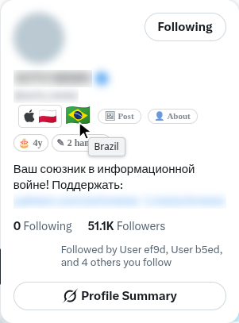
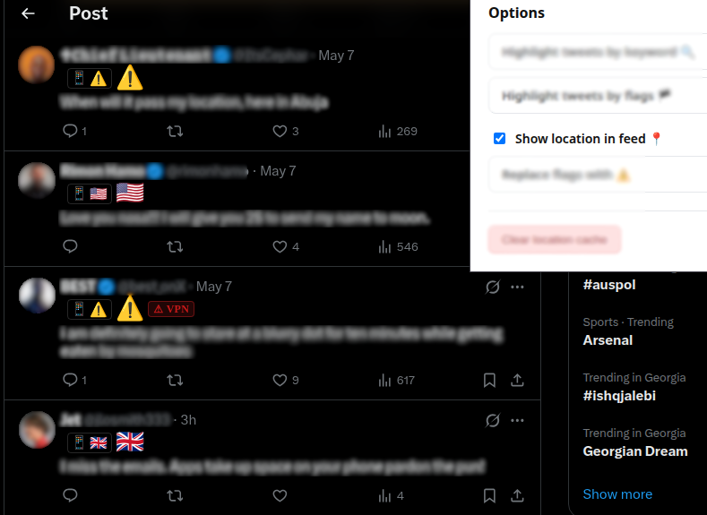
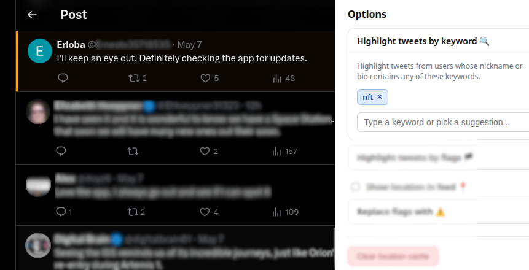
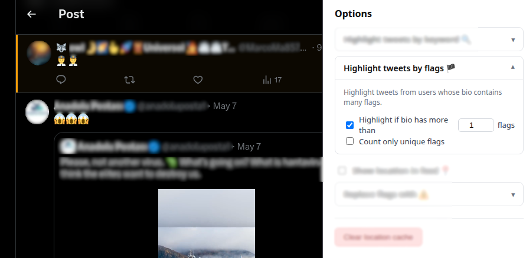

  

<h1 align="center">X Profile Location</h1>

  <strong>See where any X profile is really from.</strong> 
  Country flags in hover cards and the feed, app-store origin, VPN warnings, and filters for the accounts you'd rather not read.

  
  

  
  
  
  

  <a href="#what-it-does">Features</a> &nbsp;|&nbsp;
  <a href="#screenshots">Screenshots</a> &nbsp;|&nbsp;
  <a href="#reading-the-data-correctly">Accuracy</a> &nbsp;|&nbsp;
  <a href="#privacy">Privacy</a> &nbsp;|&nbsp;
  <a href="#install">Install</a> &nbsp;|&nbsp;
  <a href="CONTRIBUTING.md">Development</a>

X already knows which country an account posts from — it's in X's own **About this
account** panel, two taps deep on every profile. This puts it where you're actually
reading: next to the name.

> This is not a geolocation tool. It does not find anyone's physical location or
> inspect their device. It shows values X itself returns. If X returns nothing,
> there is nothing to show.

## What it does

<table>
  <tr>
    <td width="33%"><strong>Flags where you're reading</strong> Country flag in hover cards, on profiles, and inline in the feed. Regions get a three-letter tag with the full name on hover.</td>
    <td width="33%"><strong>App-store origin</strong> The country the account's app store is set to, which often differs from the account country.</td>
    <td width="33%"><strong>VPN warning</strong> A marker when X flags the account's location as possibly inaccurate.</td>
  </tr>
  <tr>
    <td><strong>Hide or collapse countries</strong> Pick countries and regions to hide outright, or collapse behind a placeholder you can open.</td>
    <td><strong>Highlight by bio keyword</strong> Flag accounts whose bio matches your keywords, with per-account exceptions.</td>
    <td><strong>Swipe on mobile</strong> Swipe right on any post to look up its author. No hover needed.</td>
  </tr>
</table>

It reads three fields from X:

| X field             | Shown as                      |
| ------------------- | ----------------------------- |
| `account_based_in`  | Country flag, or a region tag |
| `source`            | App-store origin badge        |
| `location_accurate` | Possible VPN/proxy warning    |

## X's rate limit, solved instead of hit

You've seen the failure: flags fill in at the top of a thread and then stop, or every
profile you hover spins forever. That's the rate limit — X cuts you off at **50 account
lookups per 15 minutes**, and one busy thread has more accounts in it than that, so
anything fetching greedily burns the window in seconds.

Most profiles never cost a lookup at all: they're in your 30-day local cache, or someone
else looked them up and the [shared cache](server/README.md) answers for free. The rest
is rationed by [`prefetch-queue.ts`](src/scripts/prefetch-queue.ts):

| | |
| --- | --- |
| **Real budget, not a guess** | The count comes from X's `x-rate-limit-*` headers and every lookup decrements it, hovers included. |
| **Spread, not sprinted** | The gap is recomputed as `msLeftInWindow / budget` before each lookup — about **one every 26s** at the defaults, stretching when you hover and tightening when the window refills. |
| **Hovers are never starved** | Background work stops at **70%**, leaving the last 15 lookups for accounts you point at. |
| **Ordered by what you're reading** | The feed you're scrolling drains before a thread's replies. |
| **Backs off properly** | A 429 pauses everything until the window rolls over. |

Run it dry anyway and you get a countdown to the reset, not a blank flag. The background
share (30/50/70/90%) and the pacing (`spread` or `instant`) are both yours in Options.

The scheduler is decoupled from the DOM and the network, so it's unit-tested through
`runOnce()` and `nextDelayMs()` without timers or a browser.

## Screenshots

<table>
  <tr>
    <td width="50%"> <strong>Flags in the feed</strong></td>
    <td width="50%"> <strong>Hover card</strong></td>
  </tr>
  <tr>
    <td> <strong>Keyword highlighting</strong></td>
    <td> <strong>Per-account exceptions</strong></td>
  </tr>
</table>

## Reading the data correctly

This matters more than it sounds — the data is easy to over-read.

- **Country is what X attributes to the account.** It is not a live physical location,
  and it is not where a given post came from.
- **App-store origin is account-level.** It does not prove which device made a post.
- **The VPN warning is a hint, not proof.** `location_accurate: false` can mean a VPN or
  proxy. It can also mean X is unsure.
- **Community records are contributed by other users.** They can be stale. Check
  anything important against X directly.
- **X can change everything without notice** — the query, the response shape, the page
  markup. Any of those can break this overnight.

## Privacy

No analytics. No account. No API key. No servers involved unless you turn the community
cache on.

The extension uses the X session already open in your browser. To call X's own
endpoint it captures the `authorization` header X attaches to its requests — that
header goes to X and nowhere else. Your CSRF token is deliberately never broadcast
internally, and never leaves the browser.

**If you enable the community cache**, three fields are shared for accounts you look
up: country, source label, and the location-accuracy flag. Nothing else — not bios,
not post text, not your handle, not who you looked at. Lookups carry no identifier at
all, so the server cannot link an install to the accounts it viewed. Contributions
carry a random per-install id and nothing tied to you.

It's off by default and there's a build with it compiled out entirely.

| Permission              | Why                                            |
| ----------------------- | ---------------------------------------------- |
| `storage`               | Your settings and the local location cache     |
| `x.com` / `twitter.com` | Read the page, and request account data from X |

Full text: [Privacy Policy](https://x-profile-location.pages.dev/privacy).

## Install

| Browser                             |                                                                                                                    |
| ----------------------------------- | ------------------------------------------------------------------------------------------------------------------ |
| Chrome, Edge, Brave, other Chromium | [Chrome Web Store](https://chromewebstore.google.com/detail/x-profile-location/mooomapkphlmpilnlcnpoilondlppbhi)   |
| Android                             | [Lemur Browser](https://play.google.com/store/apps/details?id=com.lemurbrowser.exts) — runs the Chrome build as-is |
| Firefox, Safari                     | Buildable from source today; store listings not up yet                                                             |

Or build it yourself — see [CONTRIBUTING.md](CONTRIBUTING.md).

## Support this

It's free, MIT-licensed, and has no ads, tracking or paid tier — and the community cache
runs on a VPS that costs real money every month.

<!-- Funding links land here once the card-to-crypto page is up; see ROADMAP.md Phase 4. -->

## Contributing

Bug reports and PRs welcome. [CONTRIBUTING.md](CONTRIBUTING.md) covers the architecture,
the test setup, and the three areas where a subtle change does the most damage.

If you just want to see whether it's any good: `pnpm test` runs 319 unit tests (plus 44 for the cache server), and
[`server/README.md`](server/README.md) has the cache server's design and benchmarks.

## Licence

[MIT](LICENSE) for the code. Landing-page copy and screenshots aren't covered by the
grant.

Not affiliated with, endorsed by, or connected to X Corp.
