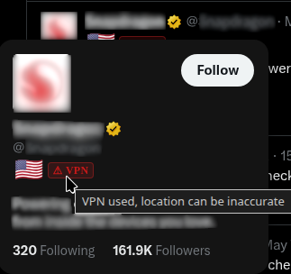
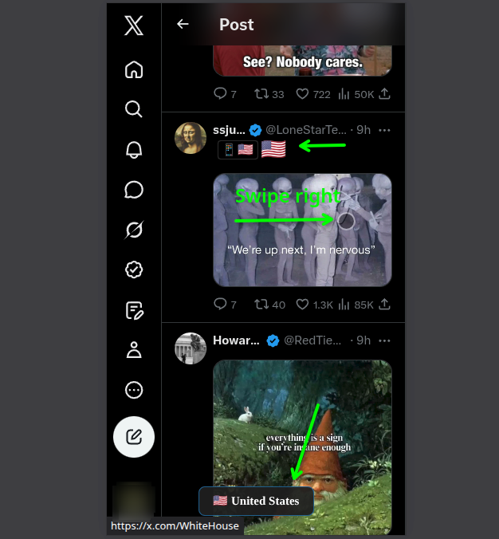

  

<h1 align="center">X-Pat — X Profile Location</h1>

  <strong>See where any X (Twitter) profile is really from.</strong> 
  Country flags in hover cards and the feed, app-store origin and VPN warnings — then hide, collapse or highlight the accounts you'd rather not read, by country, organisation, age or bio keyword.

  
  

  
  
  
  

  <a href="https://x-pat.pages.dev">Website</a> &nbsp;|&nbsp;
  <a href="#what-you-get">Features</a> &nbsp;|&nbsp;
  <a href="#screenshots">Screenshots</a> &nbsp;|&nbsp;
  <a href="#reading-the-data-correctly">Accuracy</a> &nbsp;|&nbsp;
  <a href="#privacy">Privacy</a> &nbsp;|&nbsp;
  <a href="#install">Install</a> &nbsp;|&nbsp;
  <a href="CONTRIBUTING.md">Development</a>

X already knows which country an account posts from — it's in X's own **About this
account** panel, two taps deep on every profile. This puts it where you're actually
reading: next to the name.

> This is not a geolocation tool. It does not find anyone's physical location or
> inspect their device. It shows values X itself returns. If X returns nothing,
> there is nothing to show.

## What you get

### See who you're reading

<table>
  <tr>
    <td width="33%"><strong>The country, without opening anything</strong> A flag in hover cards, on profiles, and inline in the feed. Regions get a three-letter tag with the full name on hover.</td>
    <td width="33%"><strong>The mismatch worth noticing</strong> The account's app-store country, which often disagrees with the account country — and a ⚠ when X itself says the location may be wrong.</td>
    <td width="33%"><strong>Who you're about to reply to</strong> Hovering shows account age, affiliate badge, verification, how often the handle changed, and follower count. Free: it's in data X already sent.</td>
  </tr>
</table>

### Decide what reaches your timeline

<table>
  <tr>
    <td width="33%"><strong>Skip whole countries</strong> Pick countries and regions, then choose: collapse behind a placeholder you can open, or hide outright. Collapse is the default, so nothing vanishes silently.</td>
    <td width="33%"><strong>Block an organisation at once</strong> X badges accounts affiliated with an organisation. Block the parent and every account it badges goes with it.</td>
    <td width="33%"><strong>Spot accounts that just showed up</strong> Posts from accounts younger than your threshold get an amber bar. Marked, never hidden — a new account is not evidence of anything.</td>
  </tr>
  <tr>
    <td><strong>Highlight by bio keyword</strong> An amber bar plus the matching words marked in the bio, so you know why it fired. Flag-stuffed bios get caught the same way, at your own threshold.</td>
    <td><strong>Keep your exceptions</strong> An always-show allowlist nothing can touch, plus per-rule exceptions — exempt an account from the keyword without exempting it from the country.</td>
    <td><strong>Change it mid-scroll</strong> The toolbar popup carries the two filters you actually edit while reading — locations and keywords — plus a pause switch. Edits land on the timeline behind it immediately.</td>
  </tr>
</table>

Also yours: **copy any post with its flags** as a PNG (rendered in your browser, nothing
uploaded), **import and export your settings** as JSON, a **light/dark theme** for the
extension's own screens, and **swipe right on mobile** to look up an author without a
hover. Quoted posts collapse on their own so the post quoting them stays readable, and
rows in Followers/Following lists are marked rather than hidden — removing them there
breaks the counts.

The flags themselves come from three fields X returns:

| X field             | Shown as                      |
| ------------------- | ----------------------------- |
| `account_based_in`  | Country flag, or a region tag |
| `source`            | App-store origin badge        |
| `location_accurate` | Possible VPN/proxy warning    |

## X's rate limit, solved instead of hit

You've seen the failure: flags fill in at the top of a thread and then stop, or every
profile you hover spins forever. That's the rate limit — X cuts you off at **50 account
lookups per 15 minutes**, and one busy thread has more accounts in it than that, so
anything fetching greedily burns the window in seconds.

Most profiles never cost a lookup at all: they're in your 30-day local cache, or someone
else looked them up and the [shared cache](server/README.md) answers for free. The rest
is rationed by [`prefetch-queue.ts`](src/scripts/prefetch-queue.ts):

|                                    |                                                                                                                                                                                    |
| ---------------------------------- | ---------------------------------------------------------------------------------------------------------------------------------------------------------------------------------- |
| **Real budget, not a guess**       | The count comes from X's `x-rate-limit-*` headers and every lookup decrements it, hovers included.                                                                                 |
| **Spread, not sprinted**           | The gap is recomputed as `msLeftInWindow / budget` before each lookup — about **one every 26s** at the defaults, stretching when you hover and tightening when the window refills. |
| **Hovers are never starved**       | Background work stops at **70%**, leaving the last 15 lookups for accounts you point at.                                                                                           |
| **Ordered by what you're reading** | The feed you're scrolling drains before a thread's replies.                                                                                                                        |
| **Backs off properly**             | A 429 pauses everything until the window rolls over.                                                                                                                               |

Run it dry anyway and you get a countdown to the reset, not a blank flag. The background
share (30/50/70/90%) and the pacing (`spread` or `instant`) are both yours in Options.

The scheduler is decoupled from the DOM and the network, so it's unit-tested through
`runOnce()` and `nextDelayMs()` without timers or a browser.

## Screenshots

<table>
  <tr>
    <td width="50%"> <strong>Flags in the feed</strong></td>
    <td width="50%"> <strong>Hover card</strong></td>
  </tr>
  <tr>
    <td> <strong>Keyword highlighting</strong></td>
    <td> <strong>Per-account exceptions</strong></td>
  </tr>
  <tr>
    <td> <strong>VPN/proxy warning</strong></td>
    <td> <strong>Swipe to look up, on mobile</strong></td>
  </tr>
</table>

## Reading the data correctly

This matters more than it sounds — the data is easy to over-read.

- **Country is what X attributes to the account.** It is not a live physical location,
  and it is not where a given post came from.
- **App-store origin is account-level.** It does not prove which device made a post.
- **The VPN warning is a hint, not proof.** `location_accurate: false` can mean a VPN or
  proxy. It can also mean X is unsure.
- **Community records are contributed by other users.** They can be stale. Check
  anything important against X directly.
- **X can change everything without notice** — the query, the response shape, the page
  markup. Any of those can break this overnight.

## Privacy

No analytics. No account. No API key. No servers involved unless you turn the community
cache on.

The extension uses the X session already open in your browser. To call X's own
endpoint it captures the `authorization` header X attaches to its requests — that
header goes to X and nowhere else. Your CSRF token is deliberately never broadcast
internally, and never leaves the browser.

**If you enable the community cache**, three fields are shared for accounts you look
up: country, source label, and the location-accuracy flag. Nothing else — not bios,
not post text, not your handle, not who you looked at. Lookups carry no identifier at
all, so the server cannot link an install to the accounts it viewed. Contributions
carry a random per-install id and nothing tied to you.

It's **on by default** and can be turned off in Options; there's also a build with it
compiled out entirely (`pnpm build:nocache`), and it stays inert in any build with no
cache server URL configured.

| Permission              | Why                                                     |
| ----------------------- | ------------------------------------------------------- |
| `storage`               | Your settings and the local location cache              |
| `contextMenus`          | The right-click entry that copies a post with its flags |
| `x.com` / `twitter.com` | Read the page, and request account data from X          |

Full text: [Privacy Policy](https://x-pat.pages.dev/privacy-policy).

## Compared with the alternatives

<!-- comparison:start -->

> Generated from `landing/src/data/comparison.ts` by the landing build. Edit that file, not this block.

|                                                         |   X-Pat    | X-Posed | Flags & Time | Region Blocker |
| ------------------------------------------------------- | :--------: | :-----: | :----------: | :------------: |
| Paces against the live budget in X’s rate-limit headers |     ✅     |   ❌    |      –       |       –        |
| Shared cache, so flags survive the rate limit           |     ✅     |   ✅    |      ✅      |       ❌       |
| Cache server source published                           |     ✅     |   ❌    |      ❌      |       –        |
| Cached entries cross-checked between installs           |     ✅     |   ❌    |      –       |       –        |
| Automated test suite in the repo                        | 1007 tests |  none   |      –       |       –        |

**Where [X-Posed](https://chromewebstore.google.com/detail/x-posed-account-location/oodhljjldjdhcdopjpmfgbaoibpancfk) is ahead of X-Pat:**

- **X-Posed is the mature one.** Roughly 10,000 Chrome installs against our handful, a four-month head start, and a community cache holding millions of profiles where ours holds thousands. A bigger cache genuinely means more instant flags on day one. That is a real advantage and it is not close.
- **It ships on more surfaces.** Firefox desktop, Firefox for Android, and a companion iPhone app. X-Pat is Chromium-only today — Chrome, Edge, Brave, and Kiwi on Android. Firefox is planned, iOS is not.
- **It has a language filter.** We do not, on purpose. X’s per-post language field is wrong often enough that filtering on it produces posts vanishing for no visible reason. That is a defensible call rather than a missing feature — but if filtering by language is what you came for, X-Posed has it and we do not.

Full fourteen-row table, with sources: [https://x-pat.pages.dev/x-posed-alternative](https://x-pat.pages.dev/x-posed-alternative). Store listings read 2026-08-24.

<!-- comparison:end -->

## Install

| Browser                             |                                                                                                                  |
| ----------------------------------- | ---------------------------------------------------------------------------------------------------------------- |
| Chrome, Edge, Brave, other Chromium | [Chrome Web Store](https://chromewebstore.google.com/detail/x-profile-location/mooomapkphlmpilnlcnpoilondlppbhi) |
| Android                             | [Kiwi Browser](https://github.com/kiwibrowser/src.next/releases) — runs the Chrome build as-is                   |
| Firefox, Safari                     | Buildable from source today; store listings not up yet                                                           |

Or build it yourself — see [CONTRIBUTING.md](CONTRIBUTING.md).

## Support this

It's free, MIT-licensed, and has no ads, tracking or paid tier — and the community cache
runs on a VPS that costs real money every month.

**[Donate — nowpayments.io/donation/asmyshlyaev177](https://nowpayments.io/donation/asmyshlyaev177)**
(crypto; the same link sits in the extension's popup). GitHub Sponsors isn't available in
Georgia, which is why this is a plain link rather than the usual button.

<!-- Wallet addresses for direct transfers land here too; see ROADMAP.md Phase 4. -->

## Contributing

Bug reports and PRs welcome. [CONTRIBUTING.md](CONTRIBUTING.md) covers the architecture,
the test setup, and the three areas where a subtle change does the most damage.

If you just want to see whether it's any good: `pnpm test` runs 1007 unit tests (plus 90 for the cache server), and
[`server/README.md`](server/README.md) has the cache server's design and benchmarks.

## Licence

[MIT](LICENSE) for the code. Landing-page copy and screenshots aren't covered by the
grant.

Not affiliated with, endorsed by, or connected to X Corp.
